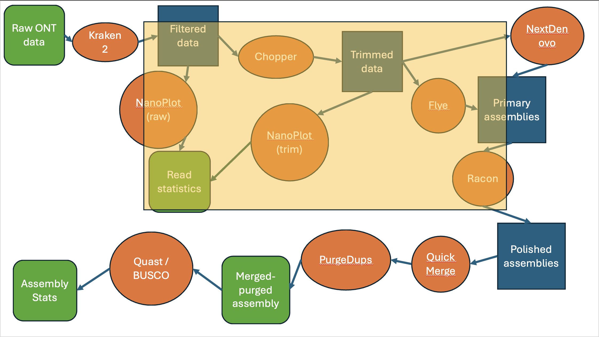

# Introduction
Here, we detail the usage, process, and known bugs of the ONTeater assembly program. This is a vertebrate genome assembly program written in NextFlow which takes only a set of longreads as input. As implied by the name, the program is written with ONT data in mind, but it will accept PacBio as well, either on its own or as a supplement to an ONT library.


This is a flowchart showing the current ONTeater process. Some details are omitted or simplified to increase comprehension. Green boxes indicate inputs or outputs, blue boxes are intermediate data files and orange circles are processes. 

Processes shaded in yellow are currently automated in NextFlow. NextDenovo is **not** automated.


# Usage
## Quickstart
```
# standard
nextflow run ONTeater.nf --genome_size 1

# record timing information
SPECIESNAME=Genus_species
nextflow run ONTeater.nf --genome_size 1 -with-trace -with-report ${SPECIES_NAME}_ONTeater.html --resume
```

The program will automatically attempt to find any ONT data in your working directory. For these files to be picked up, they must be recognizable by the regex `*ONT*.fq.gz`. Otherwise, provide them as arguments with `--input_ONTreads`. PacBio and Illumina data can be provided with `--input_PacBioreads` and `input_shortreads` respectively.
The program requires at least one file of longreads (ONT or PacBio to function). Outputs can be found in the `results/` directory.

Your genome size is assumed to be 1g - this is relevant for the nextDenovo assembly. Pass this value as an integer to edit it.


## Requirements
This pipeline has been tested on a Linux cloud cluster with 96 cores and 755 GB RAM. I am unsure how it will perform on smaller clusters. It does not use Slurm or other package management systems.
[nextDenovo](https://nextdenovo.readthedocs.io/en/latest/) is a major resource hog, and constitutes the maximal demand on the system.

## Installation
Install [nextFlow](https://www.nextflow.io) and [conda](https://docs.conda.io/projects/conda/en/latest/user-guide/getting-started.html) for package management within nextflow.

## Options

